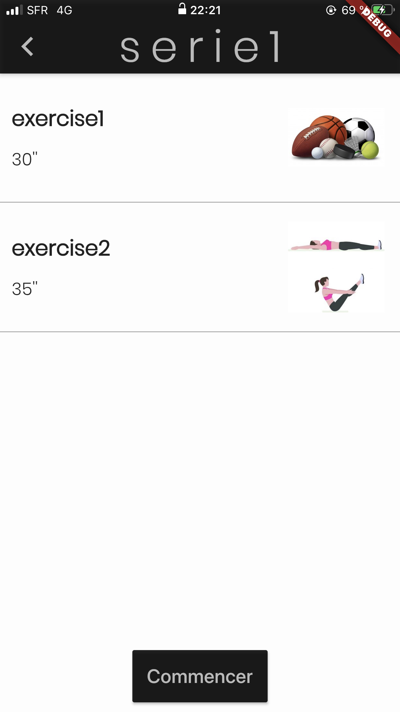
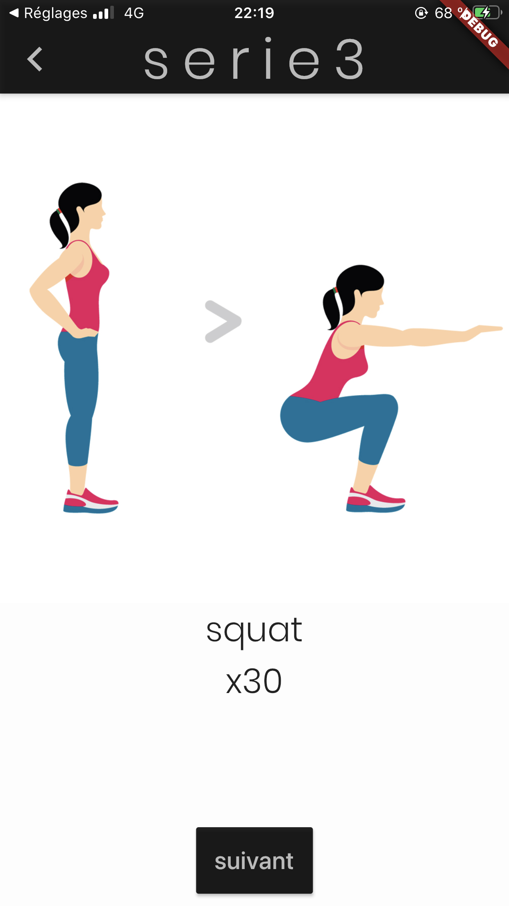
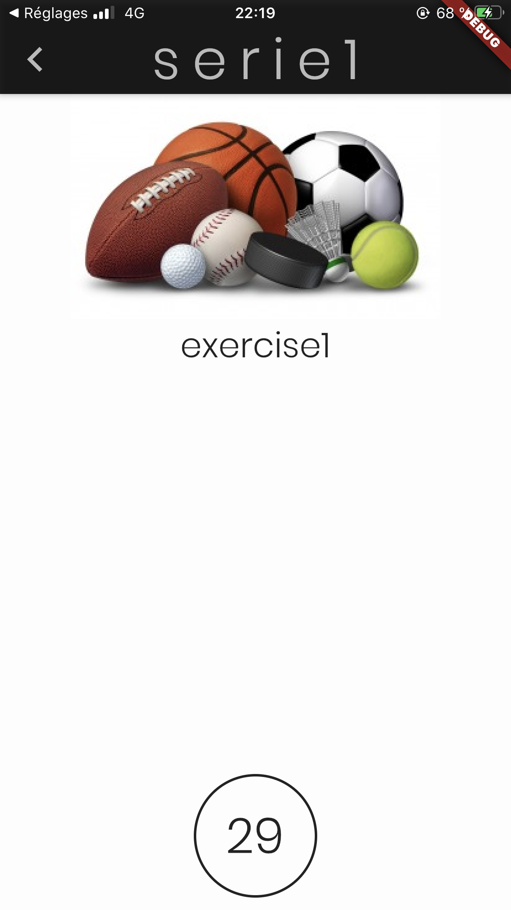

# Fitness Coaching app
The **Fitness Coaching app** is a simple mobile app with series of exercise with a timer using flutter and Dart.

In the app you can select a serie of fitness exercises, then you will see the details of the exercises in the serie and finally, by pressing start, the serie will start. 

## Test
First, set the flutter environment here: https://flutter.dev/docs/get-started/install.

Then, you can change the series of exercises in lib/data/globals.dart with the variable serieListJson. Make sure to add corresponding images with the exercise you add (the image should be name as the exercise and must be in jpg). Don't forget to add the images in the file pubspec.yalm.

Then you can run the app.

## Screenshots

        

## Developed with
- MacOs
- Android Studio
- Xcode
- Flutter

